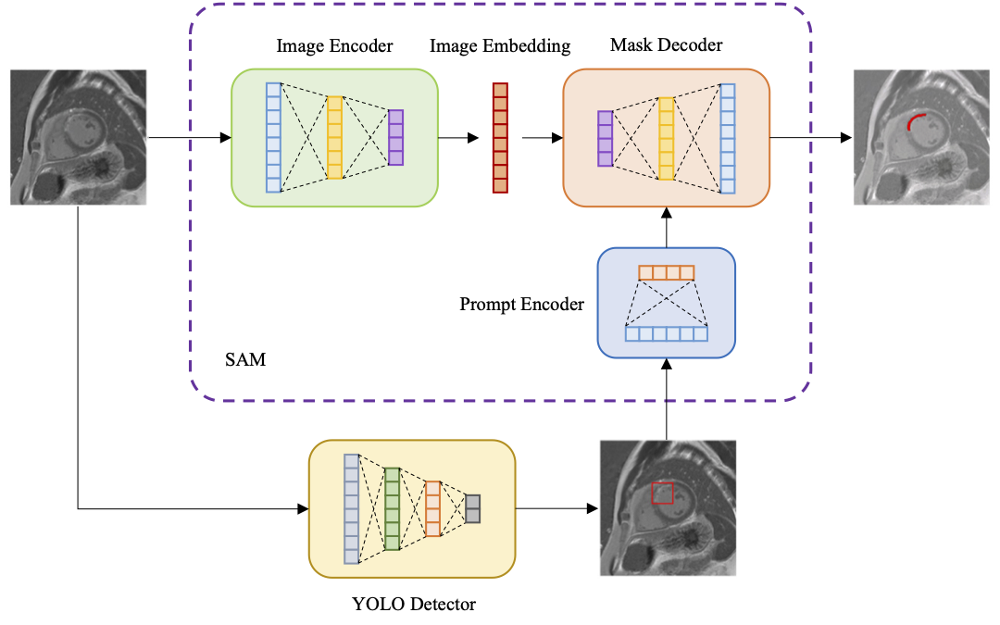
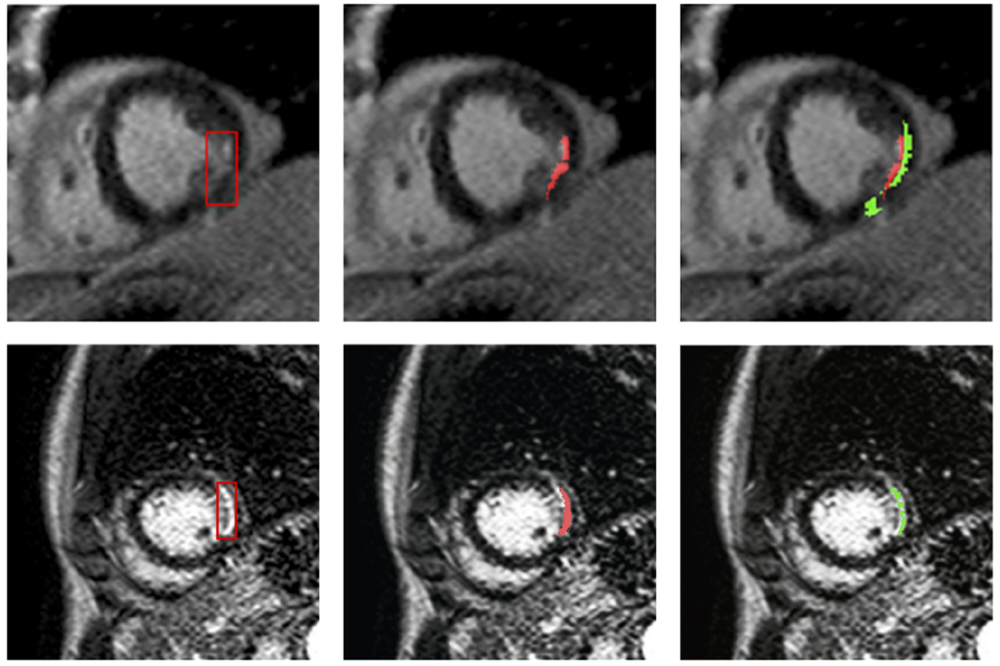

# Robust Deep Learning for Myocardial Scar Segmentation in Cardiac MRI with Noisy Labels

[](https://conferences.miccai.org/2025/en/)
[](https://www.python.org/downloads/)
[](https://pytorch.org/)

## Abstract

The accurate segmentation of myocardial scars from cardiac MRI is essential for clinical assessment and treatment planning. In this study, we propose a robust deep-learning pipeline for fully automated myocardial scar detection and segmentation by fine-tuning state-of-the-art models. The method explicitly addresses challenges of label noise from semi-automatic annotations, data heterogeneity, and class imbalance through the use of Kullback-Leibler loss and extensive data augmentation. We evaluate the model's performance on both acute and chronic cases and demonstrate its ability to produce accurate and smooth segmentations despite noisy labels. In particular, our approach outperforms state-of-the-art models like nnU-Net and shows strong generalizability in an out-of-distribution test set, highlighting its robustness across various imaging conditions and clinical tasks. These results establish a reliable foundation for automated myocardial scar quantification and support the broader clinical adoption of deep learning in cardiac imaging.

## Architecture Overview


*Figure 1: YoloSAM pipeline combining YOLO for detection and SAM for precise segmentation*

## Sample Results


*Figure 2: Sample myocardial scar detection and segmentation results on cardiac MRI*

## Key Features

- **Robust to Noisy Labels**: Handles semi-automatic annotation noise using Kullback-Leibler loss
- **Two-Stage Pipeline**: YOLO for efficient detection + SAM for precise segmentation
- **Data Augmentation**: Extensive augmentation strategies for improved generalization
- **Class Imbalance Handling**: Specialized loss functions for imbalanced medical data
- **Cross-Domain Robustness**: Strong performance on out-of-distribution test sets
- **Clinical Ready**: Outperforms nnU-Net and other state-of-the-art methods

## Quick Start

### Installation

```bash
# Clone the repository
git clone https://github.com/yourusername/YoloSAM.git
cd YoloSAM

# Install dependencies
pip install -e .

# Download pre-trained models
python utils/download_model.py
```

### Inference

```python
from scripts.inference import YoloSAMInference

# Initialize the model
model = YoloSAMInference()

# Run inference on a cardiac MRI image
result = model.predict("path/to/cardiac_mri.png")
```

## Project Structure

```
YoloSAM/
├── models/ # Core model implementations
│ ├── yolo.py # YOLO detection model
│ ├── sam.py # SAM segmentation model
│ └── init.py
├── scripts/ # Training and inference scripts
│ ├── train_yolo.py # YOLO training script
│ ├── train_sam.py # SAM fine-tuning script
│ ├── inference.py # Inference pipeline
│ └── init.py
├── utils/ # Utility functions
│ ├── config.py # Configuration management
│ ├── dataset.py # Dataset handling
│ ├── loss.py # Custom loss functions (KL loss + Dice + BC)
│ ├── prompt.py # SAM prompting strategies
│ ├── mask_to_yolo.py # Mask to YOLO format conversion
│ ├── z_score_norm.py # Normalization utilities
│ └── download_model.py # Model downloading
├── notebooks/ # Jupyter notebooks
│ └── YoloSAM_Tutorial.ipynb # Complete tutorial
├── sample_data/ # Example data and structure
│ ├── dataset.yaml # Dataset configuration
│ ├── train/ # Training data
│ └── val/ # Validation data
├── checkpoints/ # Model checkpoints
├── README.md              # Project documentation
├── LICENSE                # MIT License
└── setup.py               # Package installation
```

## Data Structure

The project expects data in the following format:
```
your_dataset/
├── train/
│ ├── images/ # Cardiac MRI images (.png/.jpg)
│ └── masks/ # Segmentation masks (.png)
├── val/
│ ├── images/
│ └── masks/
```

## Models

### YOLO Detection Model (`models/yolo.py`)
- Efficient object detection for myocardial scar localization
- Handles class imbalance through weighted loss functions
- Optimized for medical imaging with custom anchors

### SAM Segmentation Model (`models/sam.py`)
- Fine-tuned Segment Anything Model for precise segmentation
- Custom prompting strategies for cardiac MRI
- Robust to noisy labels using KL divergence loss


## Google Colab Tutorial

For easy experimentation and fine-tuning, check out our comprehensive Jupyter notebook:

[](https://colab.research.google.com/github/Danialmoa/YoloSAM/blob/main/notebooks/YoloSAM_Tutorial.ipynb)

The notebook includes:
- Step-by-step setup instructions
- Data preparation and augmentation
- Model training and fine-tuning
- Evaluation and visualization
- Results analysis and comparison

  
## Acknowledgments

We thank the following projects and teams for their foundational work:

- **Meta AI Research** for developing and open-sourcing the [Segment Anything Model (SAM)](https://github.com/facebookresearch/segment-anything)
- **Ultralytics** for the [YOLOv12](https://github.com/ultralytics/ultralytics) object detection framework

This work builds upon these excellent foundations to advance automated myocardial scar segmentation in cardiac MRI.


## Citation

If you use this code in your research, please cite our paper:
```bibtex
```

## Contact

For questions and collaborations, please contact: [am1392@leicester.ac.uk, d.moafi@student.unisi.it]

## License

This project is licensed under the MIT License - see the [LICENSE](LICENSE) file for details.
